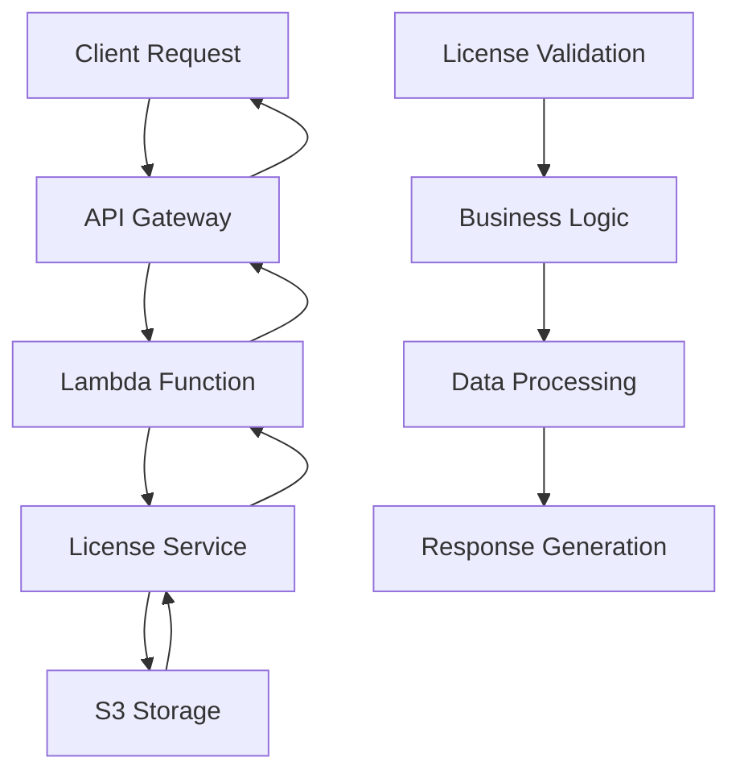

# 📄 InfyLicense

[](https://www.oracle.com/java/)
[](https://spring.io/projects/spring-boot)
[](https://aws.amazon.com/)
[](https://maven.apache.org/)
[](LICENSE)
[](https://github.com/strivedi4u/infyLicense/stargazers)
[](https://github.com/strivedi4u/infyLicense/network)

> 🚀 A Spring Boot-based license management system with AWS integration for serverless deployment

## 📖 Table of Contents

- [Overview](#-overview)
- [Features](#-features)
- [Technology Stack](#-technology-stack)
- [Architecture](#-architecture)
- [Getting Started](#-getting-started)
- [Installation](#-installation)
- [Usage](#-usage)
- [API Documentation](#-api-documentation)
- [Data Flow](#-data-flow)
- [Project Structure](#-project-structure)
- [Configuration](#-configuration)
- [Deployment](#-deployment)
- [Contributing](#-contributing)
- [License](#-license)
- [Support](#-support)

## 🎯 Overview

InfyLicense is a modern, cloud-native license management system built with Spring Boot and designed for AWS serverless deployment. It provides a robust solution for managing software licenses with seamless cloud integration.

### 🌟 Key Highlights

- 🔧 **Spring Boot Framework** - Enterprise-grade Java application
- ☁️ **AWS Serverless** - Lambda-ready deployment
- 📦 **S3 Integration** - Secure file storage
- 🏗️ **Maven Build** - Standardized build process
- 🔒 **Secure** - Enterprise security standards

## ✨ Features

- 📋 **License Management** - Create, read, update, and delete licenses
- 🔄 **RESTful APIs** - Clean and intuitive API endpoints
- ☁️ **Cloud Storage** - AWS S3 integration for file management
- 🚀 **Serverless Ready** - AWS Lambda deployment support
- 🔧 **Configurable** - Environment-based configuration
- 📊 **Monitoring Ready** - Built-in health checks and metrics

## 🛠 Technology Stack

### Backend
-  **Java 11**
-  **Spring Boot 2.7.9**
-  **Maven**

### Cloud & Infrastructure
-  **AWS Lambda**
-  **AWS S3**
-  **Serverless Framework**

### Tools & Build
-  **Git**
-  **GitHub**

## 🏗 Architecture

```
┌─────────────────┐    ┌─────────────────┐    ┌─────────────────┐
│   Client App    │    │   API Gateway   │    │  Lambda Function│
│                 │───▶│                 │───▶│  (Spring Boot)  │
│  (Web/Mobile)   │    │     (AWS)       │    │                 │
└─────────────────┘    └─────────────────┘    └─────────────────┘
                                                        │
                                                        ▼
                                               ┌─────────────────┐
                                               │   AWS S3 Bucket │
                                               │  (File Storage) │
                                               └─────────────────┘
```

## 🚀 Getting Started

### Prerequisites

Before you begin, ensure you have the following installed:

- ☕ **Java 11 or higher**
- 📦 **Maven 3.6+**
- 🔧 **Git**
- ☁️ **AWS CLI** (for deployment)

### Quick Start

```bash
# Clone the repository
git clone https://github.com/strivedi4u/infyLicense.git

# Navigate to project directory
cd infyLicense

# Build the project
./mvnw clean install

# Run the application
./mvnw spring-boot:run
```

## 📥 Installation

### Local Development

1. **Clone the repository**
   ```bash
   git clone https://github.com/strivedi4u/infyLicense.git
   cd infyLicense
   ```

2. **Build the project**
   ```bash
   ./mvnw clean compile
   ```

3. **Run tests**
   ```bash
   ./mvnw test
   ```

4. **Start the application**
   ```bash
   ./mvnw spring-boot:run
   ```

### Docker (Optional)

```dockerfile
FROM openjdk:11-jre-slim
COPY target/licence-0.0.1-SNAPSHOT.jar app.jar
EXPOSE 8080
ENTRYPOINT ["java", "-jar", "/app.jar"]
```

## 💡 Usage

### Basic API Calls

```bash
# Health Check
curl -X GET http://localhost:8080/actuator/health

# Get Licenses (example endpoint)
curl -X GET http://localhost:8080/api/licenses

# Create License (example endpoint)
curl -X POST http://localhost:8080/api/licenses \
  -H "Content-Type: application/json" \
  -d '{"name": "Enterprise License", "type": "COMMERCIAL"}'
```

### Configuration

```yaml
# application.yml
server:
  port: 8080

spring:
  application:
    name: infylicense

aws:
  s3:
    bucket-name: ${S3_BUCKET_NAME:infylicense-bucket}
    region: ${AWS_REGION:us-east-1}
```

## 📚 API Documentation

### Endpoints Overview

| Method | Endpoint | Description |
|--------|----------|-------------|
| `GET` | `/api/licenses` | Get all licenses |
| `POST` | `/api/licenses` | Create new license |
| `GET` | `/api/licenses/{id}` | Get license by ID |
| `PUT` | `/api/licenses/{id}` | Update license |
| `DELETE` | `/api/licenses/{id}` | Delete license |
| `GET` | `/actuator/health` | Health check |

### Request/Response Examples

```json
// POST /api/licenses
{
  "name": "Enterprise License",
  "type": "COMMERCIAL",
  "validFrom": "2025-01-01",
  "validTo": "2025-12-31",
  "features": ["API_ACCESS", "PREMIUM_SUPPORT"]
}

// Response
{
  "id": "12345",
  "name": "Enterprise License",
  "type": "COMMERCIAL",
  "status": "ACTIVE",
  "createdAt": "2025-09-07T15:34:15Z"
}
```

## 🔄 Data Flow



## 📁 Project Structure

```
infyLicense/
├── 📄 pom.xml                 # Maven configuration
├── 📄 README.md               # Project documentation
├── 📄 LICENSE                 # License file
├── 📁 .mvn/                   # Maven wrapper
├── 📁 src/
│   ├── 📁 main/
│   │   ├── 📁 java/
│   │   │   └── 📁 com/
│   │   │       └── 📁 infy/
│   │   │           └── 📁 licence/
│   │   │               ├── 📄 LicenseApplication.java
│   │   │               ├── 📁 controller/
│   │   │               ├── 📁 service/
│   │   │               ├── 📁 model/
│   │   │               └── 📁 config/
│   │   └── 📁 resources/
│   │       ├── 📄 application.yml
│   │       └── 📄 application-prod.yml
│   └── 📁 test/
│       └── 📁 java/
├── 📄 mvnw                    # Maven wrapper script
└── 📄 mvnw.cmd               # Maven wrapper script (Windows)
```

## ⚙️ Configuration

### Environment Variables

```bash
# AWS Configuration
export AWS_REGION=us-east-1
export S3_BUCKET_NAME=infylicense-bucket
export AWS_ACCESS_KEY_ID=your-access-key
export AWS_SECRET_ACCESS_KEY=your-secret-key

# Application Configuration
export SPRING_PROFILES_ACTIVE=prod
export SERVER_PORT=8080
```

### Application Properties

```properties
# Server Configuration
server.port=8080
management.endpoints.web.exposure.include=health,info

# AWS S3 Configuration
aws.s3.bucket-name=${S3_BUCKET_NAME:infylicense-bucket}
aws.s3.region=${AWS_REGION:us-east-1}

# Logging
logging.level.com.infy.licence=DEBUG
logging.pattern.console=%d{yyyy-MM-dd HH:mm:ss} - %msg%n
```

## 🚀 Deployment

### AWS Lambda Deployment

1. **Build the application**
   ```bash
   ./mvnw clean package
   ```

2. **Deploy to AWS**
   ```bash
   # Using AWS SAM or Serverless Framework
   sam build
   sam deploy --guided
   ```

3. **Configure API Gateway**
   ```yaml
   # template.yaml
   AWSTemplateFormatVersion: '2010-09-09'
   Transform: AWS::Serverless-2016-10-31
   
   Resources:
     LicenseFunction:
       Type: AWS::Serverless::Function
       Properties:
         CodeUri: target/licence-0.0.1-SNAPSHOT.jar
         Handler: com.infy.licence.StreamLambdaHandler::handleRequest
         Runtime: java11
         Events:
           License:
             Type: Api
             Properties:
               Path: /{proxy+}
               Method: ANY
   ```

### Traditional Deployment

```bash
# Build JAR
./mvnw clean package

# Run JAR
java -jar target/licence-0.0.1-SNAPSHOT.jar
```

## 🤝 Contributing

We love contributions! Here's how you can help:

### 🔧 Development Workflow

1. **Fork the repository**
   ```bash
   git fork https://github.com/strivedi4u/infyLicense.git
   ```

2. **Create a feature branch**
   ```bash
   git checkout -b feature/amazing-feature
   ```

3. **Make your changes**
   ```bash
   git add .
   git commit -m "Add amazing feature"
   ```

4. **Push to your fork**
   ```bash
   git push origin feature/amazing-feature
   ```

5. **Create a Pull Request**

### 📋 Contribution Guidelines

- ✅ Write clear commit messages
- ✅ Add tests for new features
- ✅ Update documentation
- ✅ Follow Java coding standards
- ✅ Ensure all tests pass

### 🐛 Reporting Issues

Found a bug? Please create an issue with:

- 📝 Clear description
- 🔄 Steps to reproduce
- 💻 Environment details
- 📸 Screenshots (if applicable)

## 📄 License

## 📞 Support

### 💬 Get Help

- 🐛 **Bug Reports**: [Create an Issue](https://github.com/strivedi4u/infyLicense/issues)
- 💡 **Feature Requests**: [Feature Request](https://github.com/strivedi4u/infyLicense/issues)
- 📧 **Email**: [strivedi4u@example.com](mailto:strivedi4u@example.com)
- 💼 **LinkedIn**: [Shashank Trivedi](https://linkedin.com/in/strivedi4u)

### 🔗 Quick Links

- 📚 [Documentation](https://github.com/strivedi4u/infyLicense/wiki)
- 🐛 [Issue Tracker](https://github.com/strivedi4u/infyLicense/issues)
- 🔄 [Pull Requests](https://github.com/strivedi4u/infyLicense/pulls)
- 📈 [Project Board](https://github.com/strivedi4u/infyLicense/projects)

### 🌟 Other Projects

Check out my other projects:
- [🔍 GoQuery](https://github.com/strivedi4u/GoQuery) - Go-based query system
- [🎵 Moodify](https://github.com/strivedi4u/moodify) - Mood-based music application
- [🧠 Brainic](https://github.com/strivedi4u/brainic) - AI-powered brain training
- [🏠 Gavina](https://github.com/strivedi4u/gavina) - Home automation system

---

<div align="center">

**⭐ Star this repository if you find it helpful!**

Made with ❤️ by [Shashank Trivedi](https://github.com/strivedi4u)

[](https://github.com/strivedi4u)
[](https://twitter.com/strivedi4u)

</div>
